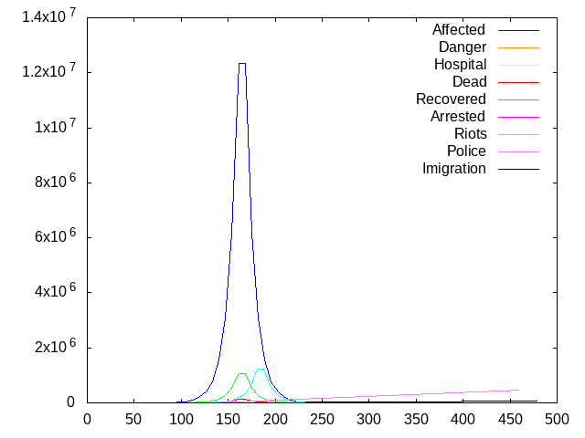

# COVID-19_OSINT
Bienvenidas al:
Grupo de Tarea Conjunta OSINT (Open-source Intelligence) para la investigación y comunicación en torno a la pandemia de SARS-COV-2/COVID-19.

Búsqueda de información y elaboración de hipótesis. Filtro de noticias y "fake-news". Investigación ciudadana crítica. Colaboración de código libre multidisciplinar.


Evitemos distraer el hilo del grupo con noticias sensacionalistas o discusiones de opinión. Las conspiranoias (http://t.me/COVID19Cowspiranoias) y opiniones excéntricas pueden ayudar a romper la ortodoxia y el discurso dominante, pero no dejemos que el grupo derive hacia eso. La política es la gestión de los asuntos públicos por parte de los ciudadanos, pero evitemos politizar los debates en exceso y sobretodo, dentro de los paradigmas partidistas y seguidistas.

Salud !!

Documento colaborativo: https://paper.komun.org/p/covid19-OSINT

Dashboard Coronavirus COVID-19 (Mobile)
https://www.arcgis.com/apps/opsdashboard/index.html#/85320e2ea5424dfaaa75ae62e5c06e61


# Herramienta de prediccion 





# Uso 

Con el siguiente comando obtendriamos el plot del ejemplo .

Predice mas de 12 millones en españa de infectados, 766 mil personas muertas con la actual tasa de muerte del 6 % de los detectados, para dentro de aproximadamente 65 dias. Hay que tener en cuenta que es en caso de no tener vacuna, con los datos actuales extraidos de articulos y de distintas fuentes de informacion. Cada uno puede hacer sus prediccciones acorde vaya habiendo nuevos datos. Os invitamos a que encontreis un escenario que no sea horrible.

Como parametros hemos usado 8 % de tasa de recuperacion y el 6% la tasa de muertes de :

https://www.arcgis.com/apps/opsdashboard/index.html#/bda7594740fd40299423467b48e9ecf6

La tasa de hospitalizacion segun 

https://www.redaccionmedica.com/secciones/sanidad-hoy/coronavirus-mortalidad-inferior-1-en-pacientes-con-menos-de-60-anos-6396

24 cyclos de 7 dias (el ultimo como periodo de incubacion)


````
#Generate prediction

./pandemia --contact_rate 2 --infected_rate 80 --recovered 8 --hospital 25 --danger 20 --dead 6 --cycles 24 --incubation 7


#Help

./pandemia --help

The commandargs program

commandargs [OPTIONS]

Common flags:
     --contact_rate=NUM     Middle number of contacts
     --infected_rate=NUM    Number of infected vs tests realized
     --recovered=NUM        Recovered rate, Infected vs recovered persons
     --hospital=NUM         Hospitalization rate, invected vs hospitalizated
                            persons
     --danger=NUM           Danger rate, infected vs danger state infected
                            people
     --dead=NUM             Dead rate , infected vs dead people
     --cycles=INT           Number of incubation cycles
     --incubation_days=INT  Number of incubation days
     --riots=INT            Riots in time
     --imigration_rate=INT  Rate of imigrants growth
     --pillage=INT          Bandalism rate in shops or authority
                            infrastructures, cases per day
     --street_police=INT    Number of authority forces in the street, police
                            x citizens
  -? --help                 Display help message
  -V --version              Print version information


````

Zoom con las teclas + -

Mover el espacio con el cursor

*Para windows usar el fichero pandemia.exe ejecutable.


# Genome analysis 

Genomic epidemiology of novel coronavirus


https://nextstrain.org/ncov?l=clock


Users guide

https://www.ebi.ac.uk/about/vertebrate-genomics/software/exonerate-user-guide

Examples

```` 

./exonerate orf1ab2004.fasta covid


C4 Alignment:
------------
         Query: AAP49011.4 orf1ab polyprotein [SARS coronavirus ZJ01]
        Target: NC_045512.2 Severe acute respiratory syndrome coronavirus 2 isolate Wuhan-Hu-1, complete genome
         Model: ungapped:protein2dna
     Raw score: 217
   Query range: 925 -> 989
  Target range: 3034 -> 3226

  926 : TyrProProAspGluGluGluGluAspAspAlaGluCysGluGluGluGluIleAspGluTh :  946
        !:!  !|||   !!:|||!!:|||!!:!!:!.!!!:|||||||||||||||.!!!!:  !:!
        PheTyrProProAspGluAspGluGluGluGlyAspCysGluGluGluGluPheGluProSe
 3035 : TTCTACCCTCCAGATGAGGATGAAGAAGAAGGTGATTGTGAAGAAGAAGAGTTTGAGCCATC : 3095

  947 : rCysGluHisGluTyrGlyThrGluAspAspTyrGlnGlyLeuProLeuGluPheGlyAlaS :  967
        !  !:!!:!!||||||||||||||||||||||||||||||  !||||||||||||||||||!
        rThrGlnTyrGluTyrGlyThrGluAspAspTyrGlnGlyLysProLeuGluPheGlyAlaT
 3096 : AACTCAATATGAGTATGGTACTGAAGATGATTACCAAGGTAAACCTTTGGAATTTGGTGCCA : 3158

  968 : erAlaGluThrValArgValGluGluGluGluGluGluAspTrpLeuAspAspThrThrGlu :  987
        !!:!!!  .!!:!!!:!  !|||||||||:!!|||||||||||||||||||||  !!:!:!!
        hrSerAlaAlaLeuGlnProGluGluGluGlnGluGluAspTrpLeuAspAspAspSerGln
 3159 : CTTCTGCTGCTCTTCAACCTGAAGAAGAGCAAGAAGAAGATTGGTTAGATGATGATAGTCAA : 3218

  988 : GlnSer :  989
        |||!!!
        GlnThr
 3219 : CAAACT : 3226


```` 


Resumen de comparacion de proteinas originales de sars2004 , y los diferentes virus de diferentes epocas descendientes de sars2004. Resultados obtenidos con el parametro --percent de exonerate.


Proteina M 2004 , Covid 91 %

Proteina M 2004 , Batsars2020 91 %

Proteina M 2004 , Batsars2015 97 %

Proteina M 2004 , Batsars2010 98 %


Proteina Orf1ab 2004 , Covid 37 %

Proteina Orf1ab 2004 , Batsars2020 37 %

Proteina Orf1ab 2004 , Batsars2015 59 %   <----- Algo extraño ya que es mas parecida a 2004 que a 2010, y 2010 muy parecido a las 
muestras de 2020 

Proteina Orf1ab 2004 , Batsars2010 38 %


Proteina E 2004 , Covid 87 %

Proteina E 2004 , Batsars2020 87 %

Proteina E 2004 , Batsars2015 98 %

Proteina E 2004 , Batsars2010 100 %


Proteina S 2004 , Covid 42 % <------ Algo anormal en la proteina s , ha evolucionado mucho mas que su primo Batsars ? , solo en 
esta proteina ?

Proteina S 2004 , Batsars2020 55 %

Proteina S 2004 , Batsars2015 55 %

Proteina S 2004 , Batsars2010 56 %


Covid 19 contra Batsars2020 -> 47 % <--- Es "primo" de covid 19

Covid 19 contra Batsars2015 -> 37 %

Covid 19 contra Batsars2010 -> 34 % 

Covid contra Sars -> 38 % <--- Tiene mas de 2004 que de 2010 o 2015


# Posible conclusion


En diferentes momentos del tiempo sars es reintroducido en la naturaleza, al menos alrededor de 2010 y 2013, donde un virus sin mutar vuelve a generar nuevas generaciones, Covid 19 y Batsars2020 son primos, pero ambos descienden de una especie de sars2004 no conocida. Existen escapes conocidos en la zona de Wuhan. 

https://www.nature.com/articles/s41591-020-0820-9?utm_source=twt_nnc&utm_medium=social&utm_campaign=naturenews&sf231596998=1

Es una de las teorias que plantea la revista nature.

En los archivos de la carpeta fasta estan los genomas para comprobar cada uno sus propias teorias., Tienen la referencia oficial a la fuente :

https://www.ncbi.nlm.nih.gov/


# Medicamentos


     - Remdesivir
     
     - Hydroxychloroquine 
     
     
     
     
Parece que ya fueron usados para el sars y solicitada patente en laboratorio de wuhan segun wikipedia


https://es.wikipedia.org/wiki/Instituto_de_Virolog%C3%ADa_de_Wuhan


# Financiero 

...


# Riots

La situacion actual incrementa el numero de denuncias y abusos de autoridad, desabastecimiento, desinformación, abuso de poder, manipulacion de los medios causan la crispacion de los ciudadanos, pero cual es el momento que estallan y porque.


Puede una pandemia probocar disturbios segun factores claros como, denuncias a ciudadanos en contra de derechos fundamentales, o el abuso de la fuerza por parte de la autoridad ?

Son los disturbios claramente vinculados a la presencia policial ? y el aumento de sus injustas acciones ?, el numero de multas y su concentracion en las areas de las protestas ? eso desciben en nature . (todo: añadir funciones en el simulador)

A mathematical model of the London riots and their policing

https://www.nature.com/articles/srep01303#Sec12
